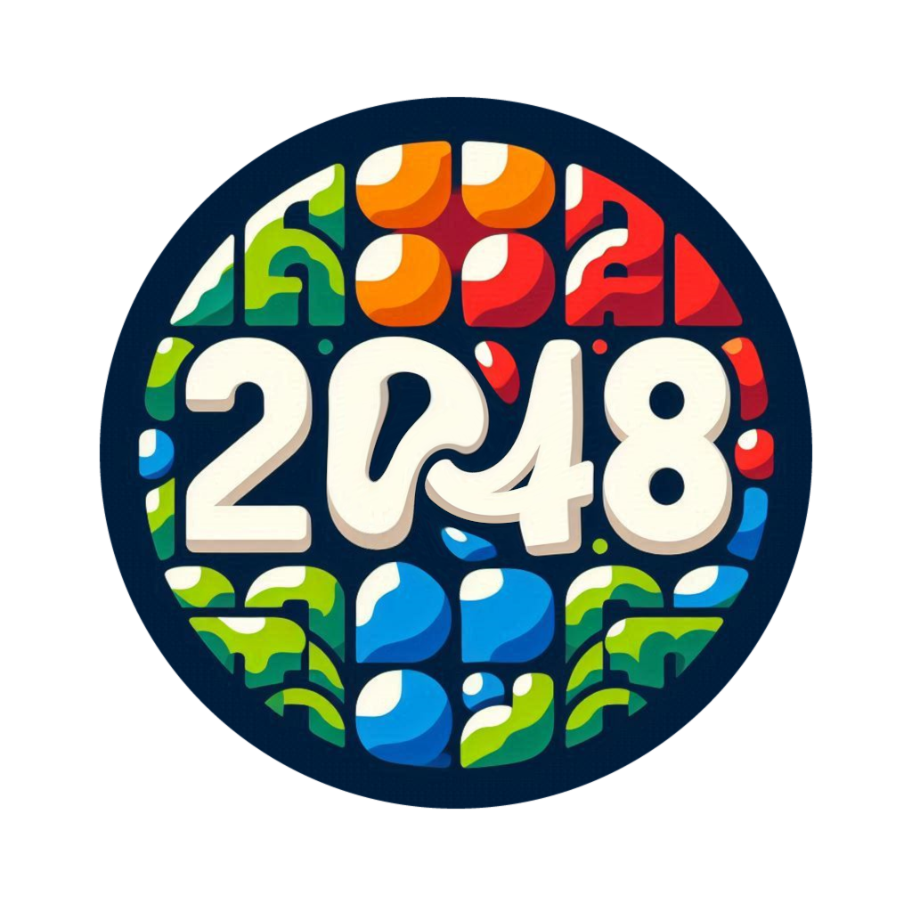

# 🎮 2048 Game (CLI)

<!-- Badges -->

<!-- Logo -->

  

## 💡 Overview
This project is a terminal-based 📟 implementation of the popular 2048 game 🕹️, developed using C++. Experience the classic puzzle challenge as you combine tiles and reach the elusive 2048 tile, all from your command line!

## 📝 Description

