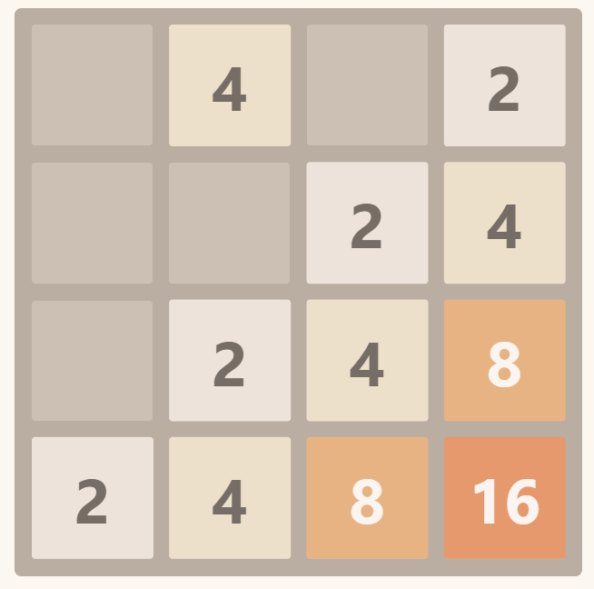

# 🎮 2048 Game (CLI)

<!-- Badges -->


[](LICENSE)

<div align="center">
  
</div>

## 💡 Overview

A modern, terminal-based implementation of the classic **2048 puzzle game** written in **C++20**. Designed with clean software engineering practices, modular architecture, RAII memory management, and cross-platform CMake build support.

---

## 📑 Table of Contents
- [Features](#-features)
- [Project Architecture](#-project-architecture)
- [Prerequisites](#-prerequisites)
- [Building and Running](#-building-and-running)
- [How to Play](#-how-to-play)
- [Controls](#-controls)
- [Contributing](#-contributing)
- [License](#-license)
- [Acknowledgments](#-acknowledgments)

---

## ✨ Features

- **Retro Arcade / Synthwave Aesthetic**: Redesigned 24-bit TrueColor terminal interface with glowing neon cards, stylish rounded frames, and gradient banners.
- **Dynamic Tile Palette**: Distinct vibrant color styles for every tile rank (2 through 2048+), providing high visual clarity and arcade polish.
- **Flicker-Free Rendering Engine**: Double-buffered stream output with ANSI cursor positioning eliminates console screen flashing.
- **Arcade Sound Effects & Embedded Retro BGM**: Integrated 8-bit retro background music looping seamlessly alongside crisp real-time synth sound effects for tile movements, merges, win fanfare, and game over. The audio asset is embedded directly inside the binary as a resource, providing a self-contained single-executable distribution with zero extra file dependencies.
- **Cross-Platform Compatibility**: Full native support for Windows, Linux, and macOS across x86_64 and ARM64 architectures.
- **Dual Controls Support**: Full navigation support for both **WASD** and **Arrow Keys** in gameplay and menus.
- **Classic 2048 Mechanics**: Slide and merge tiles to reach the coveted 2048 tile and beyond.
- **Customizable Grid Sizes**: Play on any $n \times n$ board (e.g., 3x3, 4x4, 5x5, 6x6, 8x8).
- **Modern C++20 Architecture**: Modular structure decoupled into dedicated components (Board, UI, Theme, Audio, Input, Timer, Leaderboard, Game Controller).
- **Zero Memory Leaks**: Memory managed strictly via RAII and standard library containers (`std::vector`).
- **Thread-Safe Countdown Timer**: Background asynchronous timer implemented with `std::atomic` signaling and clean thread joining.
- **Persistent Leaderboard**: Arcade-style Hall of Fame tracking high scores per board size, automatically sorted and persisted to disk.

---

## 🏛️ Project Architecture

The codebase is organized into distinct, single-responsibility modules:

```
2048/
├── CMakeLists.txt          # Modern CMake build configuration
├── resources.rc            # Windows resource file embedding audio asset
├── include/                # Header files / interfaces
│   ├── Audio.hpp           # 8-bit retro BGM and SFX audio engine
│   ├── Board.hpp           # Grid representation, tile movement & merging
│   ├── Game.hpp            # Game loop coordinator
│   ├── Input.hpp           # Cross-platform raw input dispatcher
│   ├── Leaderboard.hpp     # Score persistence & record sorting
│   ├── Theme.hpp           # 24-bit TrueColor palette, ANSI helpers & tile styles
│   ├── Timer.hpp           # Thread-safe atomic countdown timer
│   └── UI.hpp              # ANSI terminal rendering & arcade components
└── src/                    # Implementation files
    ├── Audio.cpp           # Native Windows MCI sequencer, embedded asset loader & synth
    ├── Board.cpp
    ├── Game.cpp
    ├── Input.cpp           # Windows & POSIX termios input implementation
    ├── Leaderboard.cpp
    ├── Timer.cpp
    ├── UI.cpp              # Flicker-free renderer, menu, and board UI
    └── main.cpp            # Application entry point with console setup
```

---

## 🛠️ Prerequisites

Before building, ensure you have the following installed:

- **C++ Compiler** supporting **C++20**:
  - GCC 11+ / MinGW-w64
  - Clang 13+
  - MSVC (Visual Studio 2019 version 16.11+)
- **CMake** 3.20 or newer
- **Build Tool** (Ninja or Make)

---

## 🚀 Building and Running

### 1. Clone the repository
```bash
git clone https://github.com/osumy/2048.git
cd 2048
```

### 2. Configure the build with CMake
```bash
cmake -B build -DCMAKE_BUILD_TYPE=Release
```
*(Optional: add `-G "Ninja"` or `-G "MinGW Makefiles"` if you are using specific generators).*

### 3. Compile the project
```bash
cmake --build build --config Release
```

### 4. Run the game

- **On Windows:**
  ```powershell
  .\build\2048.exe
  ```
- **On Linux / macOS:**
  ```bash
  ./build/2048
  ```

---

## 🎮 How to Play

1. Start a **New Game** from the main menu.
2. Enter your player name and desired board size (default is 4 for $4 \times 4$).
3. Use the directional keys to slide tiles across the board.
4. When two tiles with the same number collide during a move, they **merge into one** with the sum of their values.
5. Every valid move spawns a new tile (2 or 4) in an empty spot.
6. Combine tiles until you create the **2048** tile to win! You can choose to keep playing to reach higher scores.
7. The game ends when no legal moves remain or when the countdown timer expires.

---

## ⌨️ Controls

| Key | Action |
| :--- | :--- |
| <kbd>W</kbd> / <kbd>↑</kbd> | Move Up / Navigate Menu Up |
| <kbd>S</kbd> / <kbd>↓</kbd> | Move Down / Navigate Menu Down |
| <kbd>A</kbd> / <kbd>←</kbd> | Move Left |
| <kbd>D</kbd> / <kbd>→</kbd> | Move Right |
| <kbd>M</kbd> | Toggle Retro Background Music (ON/OFF) |
| <kbd>Enter</kbd> / <kbd>Space</kbd> | Select Menu Option |
| <kbd>B</kbd> | Return to Main Menu |

---

## 🤝 Contributing

Contributions are welcome! Feel free to open an issue or submit a pull request:

1. Fork the Project
2. Create your Feature Branch (`git checkout -b feat/AmazingFeature`)
3. Commit your Changes (`git commit -m "feat(core): add amazing feature"`)
4. Push to the Branch (`git push origin feat/AmazingFeature`)
5. Open a Pull Request

---

## 📄 License

Distributed under the MIT License. See [`LICENSE`](LICENSE) for more information.

---

## 📚 Acknowledgments

* [2048 Original Game by Gabriele Cirulli](https://github.com/gabrielecirulli/2048)
* [2048 on Wikipedia](https://en.wikipedia.org/wiki/2048_(video_game))
